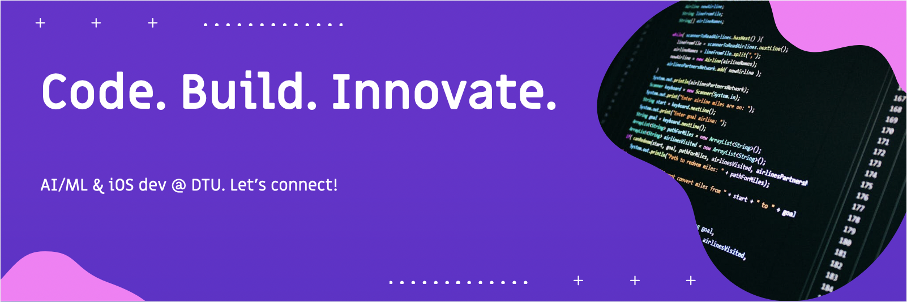
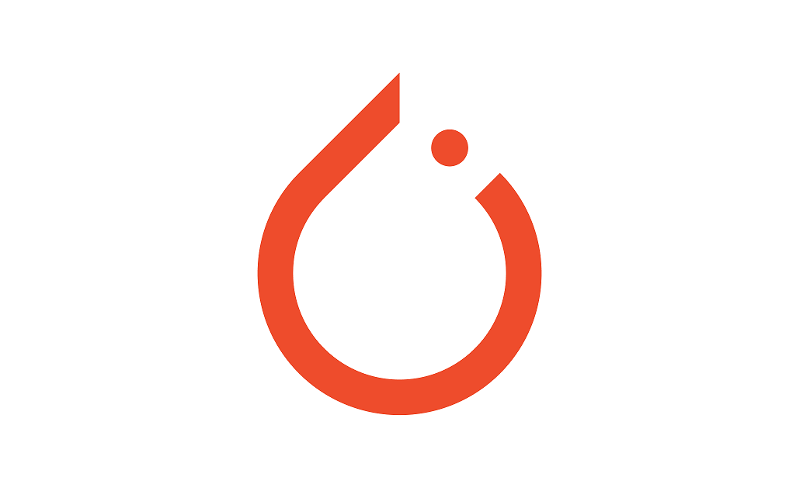

# Hi 👋, I'm Nabeel Haque

🎓 3rd-year B.Tech Computer Science student at DTU  
🧠 I work at the intersection of LLMs, Prompt Engineering, and Front-End Development  

---
### 🔗 Connect with me:

---

### ⚙️ Languages & Tools:

<table>
  <tr>
    <td align="center"> Python</td>
    <td align="center"> Swift</td>
    <td align="center"> SQL</td>
  </tr>
  <tr>
    <td align="center"> React</td>
    <td align="center"> LangChain</td>
    <td align="center"> Hugging Face</td>
  </tr>
  <tr>
    <td align="center"> PyTorch</td>
    <td align="center"> Docker</td>
    <td align="center"> Git</td>
  </tr>
</table>

---

### 📊 GitHub Stats:

---

